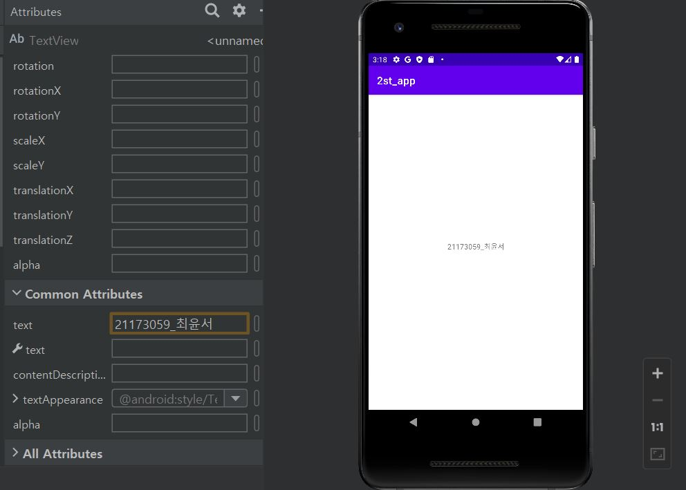
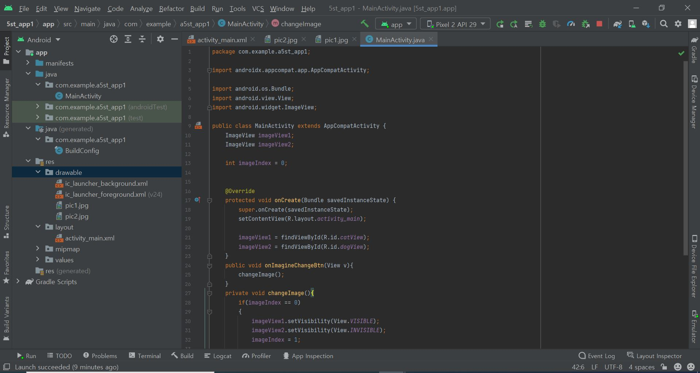

# 21173059 최윤서

## 2주차 과제

- 안드로이드스튜디오 설치 && Github 가입 및 래포지터리 만듬

  </img>

## 3주차 과제
 
  </img>
  </img>
  </img>

## 5주차 과제
</img>
</img>
</img>
</img>
</img>
</img>

## 6주차 과제
</img>
</img>
</img>
</img>
